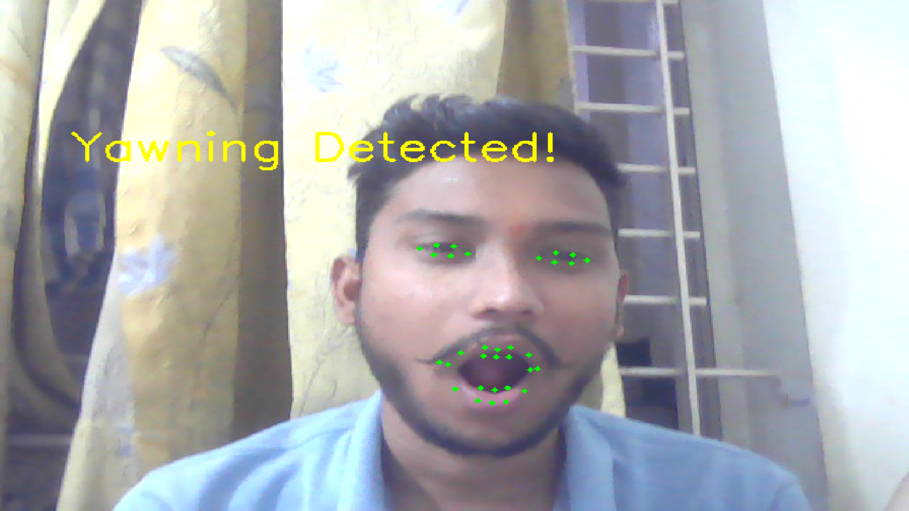

# Driver Drowsiness Detection System

## Overview
The Driver Drowsiness Detection System is a Python-based project designed to detect drowsiness in drivers using computer vision techniques. This project aims to enhance road safety by monitoring the driver's face and providing alerts if signs of drowsiness are detected.

## Features
- Real-time face and eye tracking using a webcam.
- Drowsiness detection based on eye closure and yawning detection.
- Alert system to wake the driver when signs of drowsiness are detected.
- Configurable thresholds for sensitivity.

## Screenshots
### Example of Drowsiness Detection
Below is an example of the system detecting closed eyes and triggering an alert:




## Setup and Installation
Follow the steps below to set up and run the project:

### Prerequisites
1. Ensure you have **Python 3.8+** installed on your system.
2. Install the following libraries:
   - OpenCV
   - Dlib
   - NumPy
     

### Installation Steps
1. **Clone the Repository**:
   ```bash
   git clone https://github.com/yogiydv/DRIVER_DROWSINESS.git
   cd DRIVER_DROWSINESS
   
Install Dependencies: Use the requirements.txt file to install all necessary dependencies:

bash
pip install -r requirements.txt

If the requirements.txt file is not available, manually install the dependencies:

bash
pip install opencv-python dlib numpy 

Run the Application: Launch the main script:

bash

python main.py

How It Works:

>The system uses a webcam to capture the driver's face in real time.


>Facial landmarks are detected to monitor the driver's eyes and mouth.


>The system analyzes eye closure duration and yawning frequency to detect drowsiness.


>If drowsiness is detected, an alert (sound or visual) is triggered.
